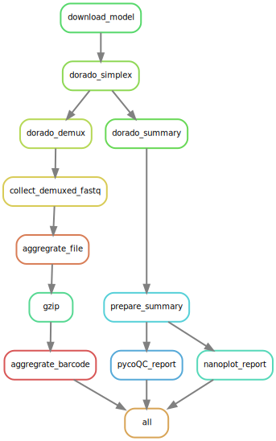

# snakemake-ont-basecalling

[](https://snakemake.github.io)
[](https://github.com/MPUSP/snakemake-ont-basecalling/actions/workflows/main.yml)
[](https://docs.conda.io/en/latest/)
[](https://apptainer.org/)
[](https://snakemake.github.io/snakemake-workflow-catalog)

A Snakemake workflow to perform basecalling and demultiplexing of Oxford Nanopore ONT data using Dorado.

## Usage

The usage of this workflow is described in the [Snakemake Workflow Catalog](https://snakemake.github.io/snakemake-workflow-catalog/docs/workflows/MPUSP/snakemake-ont-basecalling).

If you use this workflow in a paper, don't forget to give credits to the authors by citing the URL of this repository.

## Workflow overview

This workflow uses Oxford Nanopore's basecaller [dorado](https://github.com/nanoporetech/dorado) for basecalling and demultiplexing Oxford Nanopore (ONT) data. Instead of running `dorado` as a single job that uses all `pod5` files as input, basecalling is performed on each single `pod5` file separately, resulting in a single job per `pod5` file. The basecalled bam files are then demultiplexed and a summary report will be provided.
The workflow is built using [snakemake](https://snakemake.readthedocs.io/en/stable/) and consists of the following steps:

1. Parse `runs.csv` table containing the run's meta data (`python`)
2. Download the model for base calling as defined in the runs table
3. Call bases using dorado in simplex mode on each `pod5` file separately (`dorado basecaller`)
4. Demultiplex ONT data (`dorado demux`)
5. Aggregate `.fastq` files based on barcode and compress (`bgzip`)
6. Summarize basecalling information (`dorado summary`)
7. Collect QC metrics and generate reports (`pycoQC`, `NanoPlot`)

---



## Requirements

- Dorado (1.3+ tested). It can be downloaded and installed from https://github.com/nanoporetech/dorado.

## Installation

**Step 1: Clone this repository**

```bash
git clone https://github.com/MPUSP/snakemake-ont-basecalling.git
cd snakemake-ont-basecalling
```

**Step 2: Install dependencies**

It is recommended to install snakemake and run the workflow with `conda` or `mamba`. [Miniforge](https://conda-forge.org/download/) is the preferred conda-forge installer and includes `conda`, `mamba` and their dependencies.

**Step 3: Create snakemake environment**

This step creates a new conda environment called `snakemake-ont-basecalling`.

```bash
mamba create -c conda-forge -c bioconda -n snakemake-ont-basecalling snakemake snakemake-executor-plugin-slurm pandas
conda activate snakemake-ont-basecalling
```

**Step 4: Install Dorado**

- Dorado can be downloaded from https://github.com/nanoporetech/dorado.
- Define the path to the dorado binary in the `config` file (recommended: `./resources`)

**Step 5: Create all rule specific environments (optional)**

This step creates all conda environments specified in the snakemake rules. This step is optional.

```bash
# activate new environment
conda activate snakemake-ont-basecalling
snakemake -c 1 --sdm conda --conda-create-envs-only --conda-cleanup-pkgs cache --directory .test
```

## Running the workflow

### Input data

This workflow requires `pod5` input data. These input files are supplied to the workflow using a mandatory runs table linked in the `config.yml` file (default: `.test/config/runs.csv`). Each row in the runs table corresponds to a single run, for which all `pod5` files are provided via a `data_folder` column. Multiple runs can be defined in the table.
The runs table has the following layout:

| run_id      | data_folder  | basecalling_model                  | barcode_kit   |
| ----------- | ------------ | ---------------------------------- | ------------- |
| MK1C_run_01 | ".test/data" | dna_r10.4.1_e8.2_400bps_sup@v5.0.0 | SQK-PCB114-24 |

### Execution

To define rule specific resources like GPU usage, configuration profiles will be used.
See [snakemake docs](https://snakemake.readthedocs.io/en/stable/executing/cli.html#profiles) on profiles for more information.
A [default profile](workflow/profiles/default/config.yaml) for local testing and a slurm specific [cluster profile](workflow/profiles/slurm/config.yaml) is provided with this workflow.

To run the workflow from command line, change to the working directory and activate the conda environment.

```bash
cd snakemake-ont-basecalling
conda activate snakemake-ont-basecalling
```

Adjust options in the default config file `config/config.yml`.
Before running the entire workflow, perform a dry run using:

```bash
snakemake --cores 3 --sdm conda --directory .test --dry-run
```

To run the workflow with test files using **conda**:

```bash
snakemake --cores 3 --sdm conda --directory .test
```

To run the workflow with test files using **conda and apptainer**, set the dorado path to `/share/resources/dorado-<version>-linux-x64/bin/dorado` and make it available for apptainer using `bind`:

```bash
snakemake --cores 3 --sdm conda apptainer --directory .test --apptainer-args "--bind ../resources:/share/resources"
```

To run the workflow with test files on a **slurm cluster**, adjust the slurm-specific profile `workflow/profiles/slurm/config.yaml` file and run:

```bash
snakemake --sdm conda --workflow-profile workflow/profiles/slurm/ --directory .test
```

**Note:**
It is recommended to start the snakemake pipeline on the cluster using a session multiplexer like [screen](https://www.gnu.org/software/screen/manual/screen.html) or [tmux](https://www.redhat.com/en/blog/introduction-tmux-linux).

## Authors

- Dr. Rina Ahmed-Begrich
  - Affiliation: [Max-Planck-Unit for the Science of Pathogens](https://www.mpusp.mpg.de/) (MPUSP), Berlin, Germany
  - ORCID profile: https://orcid.org/0000-0002-0656-1795
- Dr. Michael Jahn
  - Affiliation: [Max-Planck-Unit for the Science of Pathogens](https://www.mpusp.mpg.de/) (MPUSP), Berlin, Germany
  - ORCID profile: https://orcid.org/0000-0002-3913-153X
  - github page: https://github.com/m-jahn

## References

> Köster, J., Mölder, F., Jablonski, K. P., Letcher, B., Hall, M. B., Tomkins-Tinch, C. H., Sochat, V., Forster, J., Lee, S., Twardziok, S. O., Kanitz, A., Wilm, A., Holtgrewe, M., Rahmann, S., & Nahnsen, S. _Sustainable data analysis with Snakemake_. F1000Research, 10:33, 10, 33, **2021**. https://doi.org/10.12688/f1000research.29032.2.
